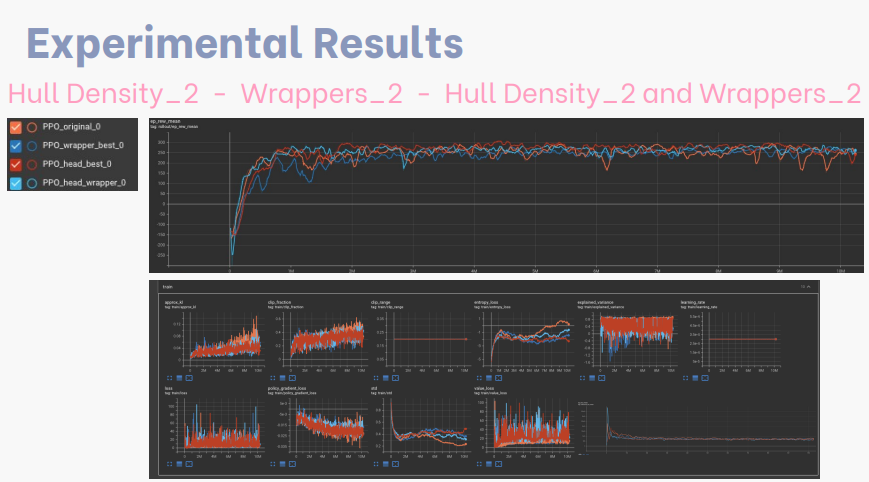

# Bipedal Walker
Assignment of the course Introduction to Intelligent and Autonomous Systems (3rd year, 1st semester)

## A little context
### Overview
The aim of this project was to introduce specific changes or customizations to the environment Bipedal Walker, from box2D, and train a reinforcement learning agent using the Stable Baselines library.
The goal is to assess how these changes impact the agent's learning process and performance.

### The environment chosen's characteristics
#### Action Space
Actions are motor speed values in the [-1, 1] range for each of the 4 joints at both hips and knees.
#### Rewards
Reward is given for moving forward, totaling 300+ points up to the far end. If the robot falls, it gets -100. Applying motor torque costs a small amount of points. A more optimal agent will get a better score.
#### States
The initial state places the robot standing at the left end with a horizontal hull, legs in a specific position, and a slight knee angle. Episodes end if the hull touches the ground or the robot exceeds the terrain length (200 steps) to the right.
#### Percepts (Observations)
Observations include various details such as hull angle speed, angular velocity, horizontal and vertical speed, joint positions, joint angular speed, leg contact with the ground, and lidar range measurements.

### Proposed changes
#### To the agents
* Density of the hull
* Changing the penalties of the actions (Creation of a penalty for sudden movements - the values were changes to optimize it)
#### To the environment
* Addition of humps
* Addiction of ditches
#### RL algorithms chosen
* PPO
* TQC
* A2C
* RecurrentPPO

### Approach taken

### Experimental Results - on tensorboard

#### Bracket

